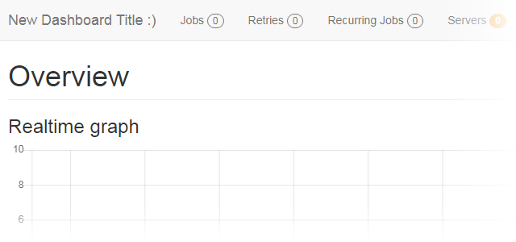

# Hangfire.Dashboard.Customize [](https://www.nuget.org/packages/Hangfire.Dashboard.Customize/) [](LICENSE)

Customize the title of your [Hangfire](https://www.hangfire.io) Dashboard.



## Give a Star! :star:

If you like or are using this project please give it a star. Thanks!

## Getting started

Install the [Hangfire.Dashboard.Customize](https://www.nuget.org/packages/Hangfire.Dashboard.Customize/) package from NuGet:

```powershell
Install-Package Hangfire.Dashboard.Customize
```

Call the method `UseHangfireDashboardCustomOptions` just before calling Hangfire's `UseHangfireDashboard`, in the configuration of your app:

```csharp
public class Startup
{
    // ...

    public void Configure(IApplicationBuilder app)
    {
        // ...

        app.UseHangfireDashboardCustomOptions(new HangfireDashboardCustomOptions
        {
            DashboardTitle = () => "My Dashboard Title :)",
        });

        // ...

        app.UseHangfireDashboard();

        // ...
    }
}
```

In your `HangfireDashboardCustomOptions` instance, you can define a function that returns the title you would like to display in your Hangfire Dashboard.

The `string` defined in the `DashboardTitle` will be written to the page as a _raw_ string, allowing the use of images and other HTML elements.

```csharp
app.UseHangfireDashboardCustomOptions(new HangfireDashboardCustomOptions
{
    DashboardTitle = () => " <b>Scheduled Jobs</b>",
});
```

---

_Copyright &copy; 2019-2020 C. Augusto Proiete & Contributors - Provided under the [Apache License, Version 2.0](http://apache.org/licenses/LICENSE-2.0.html)._
